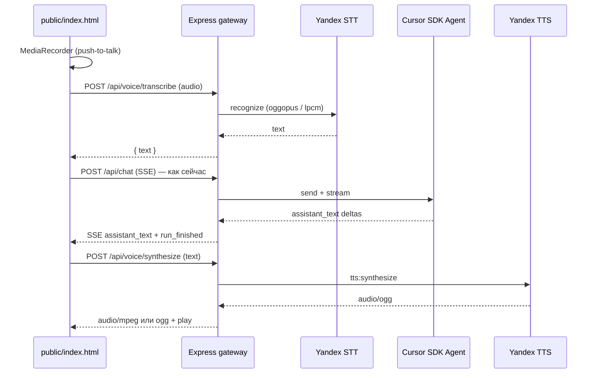

# Фаза 5: голосовой ввод и голосовой ответ (Yandex SpeechKit)

Статус: **5a+5b реализовано** (Api-Key + FolderId, автоотправка после STT).

Цель: в веб-чате `cursor_sdk_agent` говорить в микрофон → текст уходит в `/api/chat`; ответ агента можно прослушать через Yandex TTS. Ключи и folder только на VDS в `.env`, не в браузере.

---

## Предпосылки

| Требование | Зачем |
|------------|--------|
| Аккаунт Yandex Cloud + SpeechKit | STT/TTS |
| `YANDEX_API_KEY` (или IAM + сервисный аккаунт) | авторизация `Api-Key` / Bearer |
| `YANDEX_FOLDER_ID` | обязателен для части API Cloud |
| HTTPS на фронте (nginx) | `getUserMedia` в браузере на проде |
| Исходящий доступ VDS → `*.api.cloud.yandex.net` | прокси не режет SpeechKit |

Рекомендуемые голоса TTS (ru): `alena`, `filipp`, `ermil`, `jane`, `omazh` — выбор через `YANDEX_TTS_VOICE`.

---

## Архитектура



Принцип: **голос — оболочка над существующим текстовым чатом**. Brain (memory / Supabase / Qdrant / ingest) не меняется.

---

## Подфазы (рекомендуемый порядок)

### 5a — TTS «прочитать ответ» (минимальный MVP)

- Кнопка 🔊 у последнего пузыря агента.
- `POST /api/voice/synthesize` — тело `{ text, voice? }`, лимит длины (например 8–12 тыс. символов; длиннее — разбивка по абзацам).
- Ответ: `audio/ogg` (или `audio/mpeg` по `YANDEX_TTS_FORMAT`).
- UI: `<audio>` + индикатор «озвучивается…».

**Критерий готовности:** после текстового ответа один клик — слышен русский голос.

### 5b — STT «сказать → отправить»

- Кнопка 🎤 (удержание или toggle push-to-talk).
- Запись `MediaRecorder` → `audio/webm` или конвертация в **oggopus** / **lpcm** на сервере (SpeechKit принимает ограниченный набор форматов).
- `POST /api/voice/transcribe` — `multipart/form-data` или base64 JSON (как вложения чата).
- Режимы:
  - **A:** подставить текст в поле ввода (пользователь правит и жмёт Enter).
  - **B:** сразу вызвать `postChatStream()` (опция `VOICE_AUTO_SEND=true`).

**Критерий готовности:** фраза с микрофона → осмысленный ответ агента без клавиатуры.

### 5c — авто-озвучка (реализовано)

- **Запрос голосом (🎤)** → после ответа агента TTS **автоматически** (без 🔊).
- **Запрос текстом** → только текст; 🔊 вручную при необходимости.
- Настройки: голос, скорость (`speed`), громкость (клиент).
- `/api/config` → `voice: { enabled, stt, tts, defaultVoice }` (без секретов).

### 5d — потоковый STT (опционально)

- WebSocket или gRPC Streaming STT Yandex — подсказка текста «на лету» в поле ввода.
- Сложнее: отмена записи, VAD, шум офиса.

### 5e — прерывание и доступность

- Stop TTS при новом сообщении / новой записи.
- Клавиатура: хоткей микрофона (Space при фокусе не в поле ввода).
- Субтитры: текст ответа остаётся на экране (TTS дополняет, не заменяет).

---

## Backend (новые модули)

```
src/voice/
  config.ts          # isVoiceEnabled(), лимиты, голос по умолчанию
  yandex-auth.ts     # заголовок Api-Key / IAM refresh (если не API key)
  yandex-stt.ts      # recognize (sync), позже streaming
  yandex-tts.ts      # synthesize, chunking длинного текста
```

### API (все **до** `express.static`, с `optionalBasicAuthMiddleware`)

| Метод | Путь | Назначение |
|--------|------|------------|
| POST | `/api/voice/transcribe` | аудио → `{ text, confidence? }` |
| POST | `/api/voice/synthesize` | `{ text, voice? }` → binary audio |
| GET | `/api/voice/health` | ping SpeechKit (опционально, для мониторинга) |

Ограничения:

- `VOICE_MAX_AUDIO_BYTES` (например 2–5 МБ).
- Таймауты 30–60 с на вызов Yandex.
- Не логировать тело с ключами; не сохранять аудио на диск без флага `VOICE_DEBUG_SAVE_AUDIO`.

### SSE (расширение опционально)

Событие `{ kind: "tts_ready", audioUrl }` — только если позже кешируем в MinIO; для MVP проще отдельный POST после `run_finished`.

---

## Frontend (`public/index.html`)

- Toolbar: 🎤 🎤⏹ 🔊 переключатель «Озвучивать».
- Состояния: `idle | recording | transcribing | speaking`.
- Ошибки: нет HTTPS, нет разрешения микрофона, пустая расшифровка, лимит Yandex.
- При `isRequestInFlight` — блокировать второй STT.

---

## Переменные окружения

```env
VOICE_ENABLED=true
YANDEX_API_KEY=...
YANDEX_FOLDER_ID=b1g...

# STT
YANDEX_STT_LANG=ru-RU
YANDEX_STT_FORMAT=oggopus
VOICE_MAX_AUDIO_BYTES=5242880

# TTS
YANDEX_TTS_VOICE=alena
YANDEX_TTS_LANG=ru-RU
YANDEX_TTS_FORMAT=oggopus
YANDEX_TTS_SPEED=1.0

# Поведение
VOICE_AUTO_SEND=false
VOICE_AUTO_PLAY_REPLY=false
```

Альтернатива API key: `YANDEX_IAM_TOKEN` + ротация (сложнее; для VDS обычно достаточно статического Api-Key).

---

## Ссылки на API Yandex (ориентир для реализации)

- STT REST: `POST https://stt.api.cloud.yandex.net/speech/v1/stt:recognize`
- TTS REST: `POST https://tts.api.cloud.yandex.net/speech/v1/tts:synthesize`
- Заголовок: `Authorization: Api-Key <YANDEX_API_KEY>`
- Параметры folder: `folderId` в query или заголовках по доке актуальной версии Cloud.

Перед кодированием сверить актуальную документацию SpeechKit v3 / Brand Voice (если понадобится кастомный голос).

---

## Риски и ограничения

| Риск | Митигация |
|------|-----------|
| Длинный ответ агента > лимита TTS | чанки по предложениям, очередь воспроизведения |
| Задержка 2–5 с на TTS | показывать спиннер; не блокировать новый ввод |
| WebM с Chrome ≠ oggopus | ffmpeg на VDS или запись в формате, который принимает STT |
| Стоимость Cloud | лимит длины + выкл. auto-play по умолчанию |
| Конфиденциальность | не отправлять в STT вложения-файлы, только голос пользователя |

---

## Тест-план

1. `curl` synthesize с короткой фразой → валидный ogg.
2. Запись 3 с «привет» → transcribe → ожидаемый русский текст.
3. E2E: микрофон → вопрос → SSE ответ → 🔊 слышен ответ.
4. `VOICE_ENABLED=false` → кнопки скрыты, 404 на voice API.
5. Проверка с Basic Auth (те же cookie/заголовки, что и чат).

---

## Оценка

| Подфаза | Оценка |
|---------|--------|
| 5a TTS | 0.5–1 день |
| 5b STT | 1–2 дня (форматы аудио) |
| 5c авто-озвучка + config | 0.5 дня |
| 5d streaming STT | 2+ дня (опционально) |

---

## Связь с roadmap

- Не меняет `persistent_brain_memory_*.plan.md`.
- Ingest / Qdrant / Exchange / Jira — без изменений.
- После 5b удобно добавить голосовой триггер cron-отчётов («что нового в Jira за день») — отдельная идея, не в scope 5a–5c.
